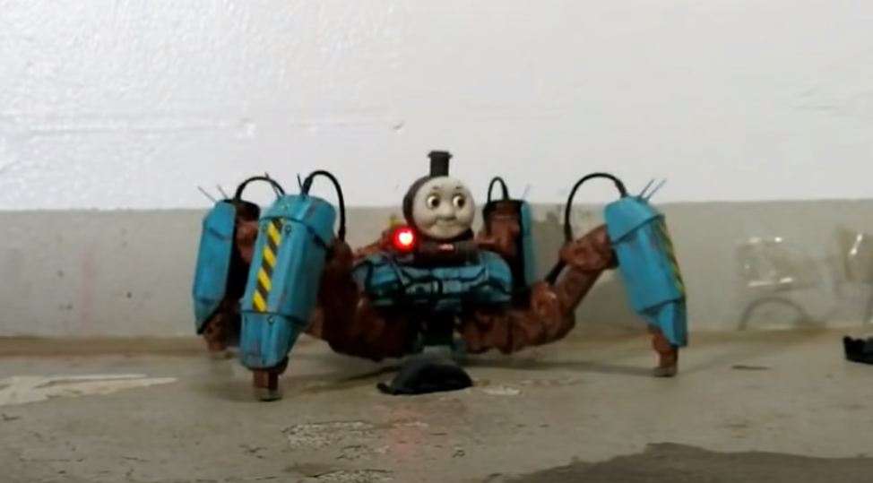
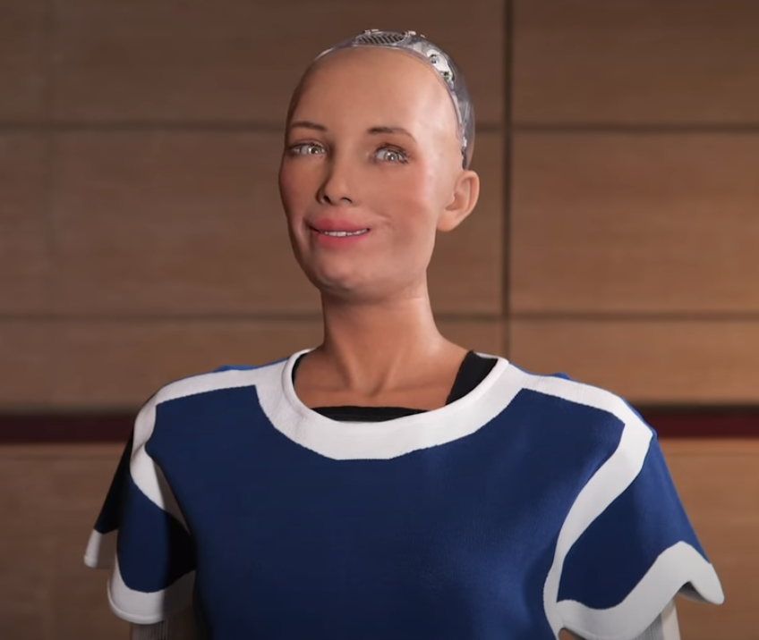
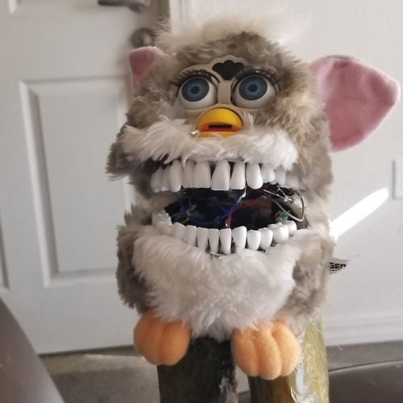
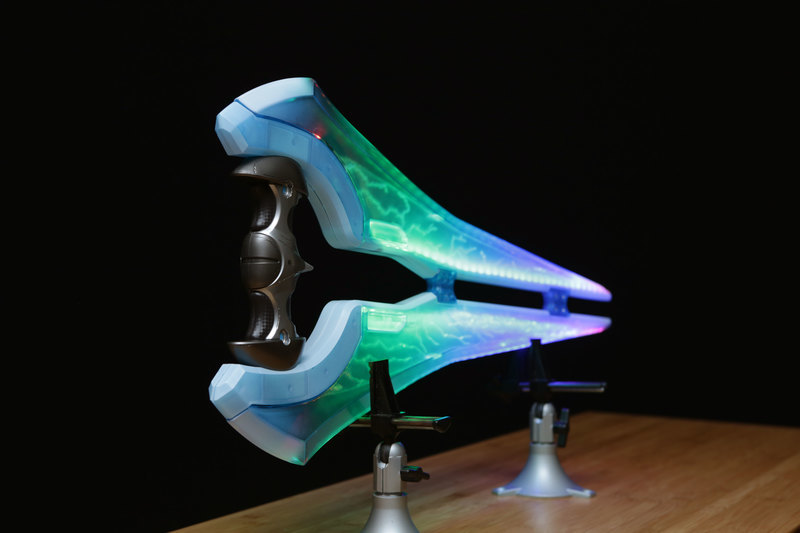
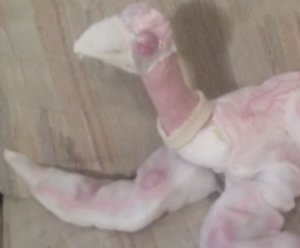
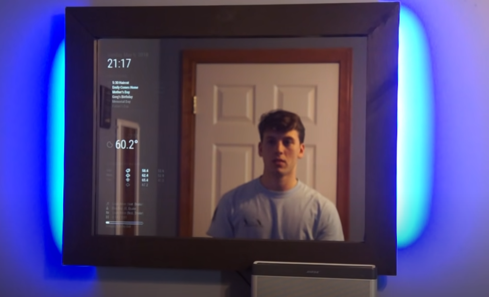
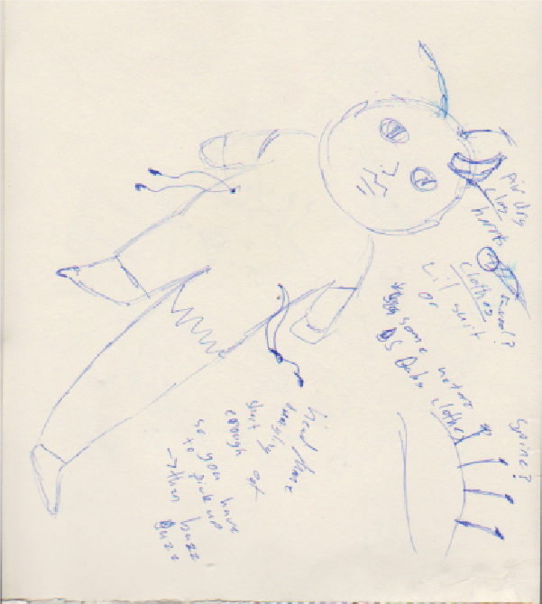
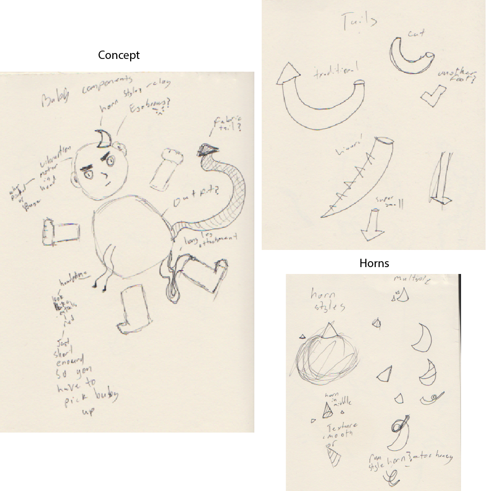
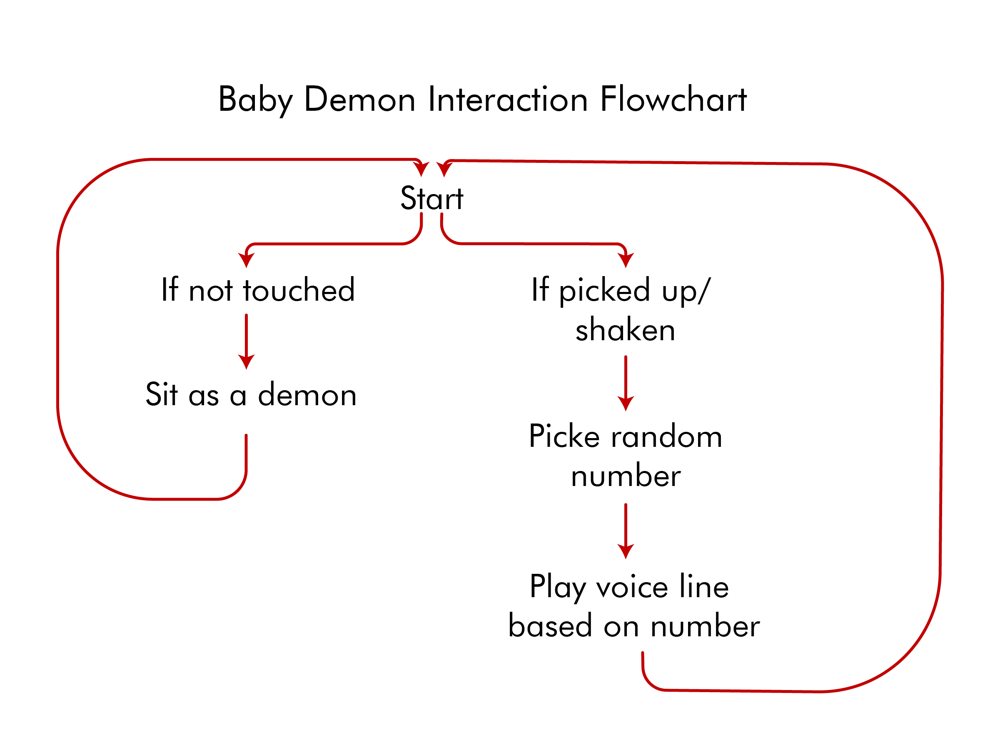

# 1701QCA Final project journal: Siarne Holdsworth
## Demon Doll ##

https://youtu.be/7dEr16h9bM8

## Related projects ##
### Related project 1 ###

Assault type Thomas

https://www.youtube.com/watch?v=2q82bGtujFA
https://www.youtube.com/watch?v=6yGbupUP4f8



This project is relevant to mine as I want to modify a toy like they have done and turn into something creepy. They have twisted a child’s toy icon into a weird uncanny valley spiderlike creature. They have also added servos to the eyes so they follower where the robot is looking making it somewhat life like. 

### Related project 2 ###
Sophia

https://www.youtube.com/watch?v=Sq36J9pNaEo
https://www.hansonrobotics.com/sophia/


(8:46)
Sophia the robot is relevant to my project as she is the cutting edge on AI technology and voice synthesis. Personally, I find her creepy as she falls into the uncanny valley. Her speech is just off enough that it almost sounds human, but it is still robotic. Also, her face is incredibly in the uncanny valley. I wish to implement voice synthases into this haunted doll to create integration between doll and person. 

### Related project 3 ###
Charlie, Furby Mod

https://daydehlus.tumblr.com/post/174958567438/made-this-handsome-boy-a-little-while-back-but



Charlie relates to my project as he is a horrifying Furby mod. They light up from inside the mouth. He screams horrifically and overall is incredibly unsettling and I hope to make something even close to the level of weirdness as them. I honestly could write a lot about how inspired I get from the Furby modding community however most of them don’t have a lot of circuity added onto them.  
### Related project 4 ###
Neopixel Upgrade: Halo Energry Sword

https://learn.adafruit.com/halo-energy-sword-by-mattel-neopixel-upgrade/overview


The project was relevant to me as it shows how you can use neopixels to upgrade something that already has lights in it. It was interesting to watch the breakdown of the project from how you should test pre-existing electronics to make sure you don’t fry anything you add. I was also interesting to be introduced to a small microcontroller that works for neopixels. I may not use neopixels however I do want to add at least some LED element to the doll. 

### Related project 5 ###
FLAP CHILD 

https://samsketchbook.tumblr.com/day/2019/03/22


I saw this sculpture last year and I haven’t been able to get it out of my head. These sculptures inspire me heavily. I love how horrible and fleshy it is. The weird way they move. The low fi speaker. However even though I love them I cant replicate them so I merely have to draw inspiration for thier bizarreness. 

### Related project 6 ###
ALEXA Smart Mirror (New Build)

https://www.youtube.com/watch?v=aa3VVZA0e5Y



This was a relevant build to this project as it went though each DIY step on integrating smart technology into a mirror. It was interesting to see how the Hodge podded to the mirror together to create a smooth piece of technology. The interactions between preexisting tech into a new form is rather interesting and relevant as I need to think of how I don’t have to reinvent the wheel to create something interesting and unique. 
This project is related to mine because *insert reasons here*.


## Other research ##
The uncanny valley is where the human like elements of an object relates to how we relate to something. Once we reach a point in likeness humans find objects uncanny and unsettling. Things such a robots, dead bodies and certain children’s toys. Once something becomes to human, we become horrified of it. The whole project is based around this premise. 
Moore, Roger K. “A Bayesian Explanation of the ‘Uncanny Valley’ Effect and Related Psychological Phenomena.” Scientific Reports 2, no. 1 (2012). https://doi.org/10.1038/srep00864.

Robert the doll is reportedly one of the most haunted dolls in the world. It is reported that is was a one of a kind creation of the Germany company Steiff Company at the turn of the century. Robert was lifelong companion of Eugene Otto. Eugene would often shift blame for any actions seen as misbehaving to Robert. After the death of Eugene, the new tenants of his family home would often hear strange noises and movement within the house.  Robert has also been blamed for camera malfunction, lights flickering and general torment to those who visit him. “INSIDE ROBERT THE DOLL...” ROBERT THE DOLL. Accessed May 10, 2020. http://robertthedoll.org/.
Robert the doll may or may not be haunted however he is unnerving. Even if it is the power of thought people place onto him. It could also be due to the fact he looks rather unsettling to modern standards of doll and his portions are very long and gangly compared to most modern dolls. He is apart of the reason I wanted to create a haunted doll for this project. To create a ‘real’ haunted doll when you touch it. To impart something unsettling on the audience. 

The other influence on the overall design aesthetics of the doll is the baby antichrist and demonic possession. The devil is the spawn point for most of the Christians greatest fear throughout history. This ranges from the fear of witches, demon possessions and satanic cults. These fears have spread across the western world as earlier as the fourteenth century. The demonic possession is the fear that a body will be corrupted by the devil (Levack, Brian P.). This idea of the devil corrupting is very frightening, this even more so if it is the thing in society, we cherish most a newborn baby. Therefore, I have corrupted the doll into a demon. It however is not fully demonic still harkening back to the fact it is still a baby doll at its core.  
Levack, Brian P. "The Horrors of Witchcraft and Demonic Possession." Social Research: An International Quarterly 81, no. 4 (2014): 921-939. https://www.muse.jhu.edu/article/566958.


## Conceptual development ##
The first sketch is the first version I got that involved weirder for the sake of weird elements instead of being themed. Though the second set of sketches I narrowed down what elements and themes I needed in the work. 
!
!

### Design intent ###
The intent of this work is the create an unsettling doll.

### Design ideation ###

### Design concept 1 ###
A soft sculpture that barley moves and lights up in different ways. It would also mimic the looks of animals however it would be spliced with multiple creates like a chimera from hell.

### Design concept 2 ###
A satanic bleeding goat doll. The idea is to modify a sheep doll to become a satanic toy. With a pentagram on its for head and blood dripping from its eyes. This would be made with a fluid pump pumping fluid out of eye holes. Also, it could have red glowing eyes. It would also have AI synthesised bleets and it would chant hymens robotically. 

### Final design 3 ###
The main idea I have chosen to go with is a modified baby doll. This doll with speak when it can hear people are around. Once picked up it will vibrate in the persons hand. I want to incorporate some form of lighting, but I am currently unsure how. It will also have elements of its from changed such as one of its legs being elongated to create something even more unsettling. 

### Final design concept ###
The concept of this work was to modify a baby doll to create an unsettling experience. This has been based of the idea of ‘haunted dolls’ and the idea of demon possession taking over the body. I wanted to create something unsettling and kind of weird. This has mannifested as a talking demon doll.

### Interaction flowchart ###
<!--- Include an interaction flowchart of the interaction process in your project. Make sure you think about all the stages of interaction step-by-step. Also make sure that you consider actions a user might take that aren't what you intend in an ideal use case. Insert an image of it below. It might just be a photo of a hand-drawn sketch, not a carefully drawn digital diagram. It just needs to be legible. --->

!

## Process documentation ##
### 1. The Long Leg ###

The first fabrication step of this project was the removing of the baby’s leg. Making a larger leg extension from fabric and sewing it together. 

The leg was than reattached to the body and foot. Later on, in the project I came back to the leg and restuffed it with cotton balls as it made the leg feel more substantial and weirder. This was due to the cotton balls feeling like sperate entities within the leg. 

### 2. The Horned Ones ###


I created the horns out of aluminium foil and air-dry clay. The first step was to test out what size and shape would be appropriate for the baby’s head. I created small aluminium foil bases to test the shapes against the baby’s head. I really liked the curved horned and hoped that would be the finale one.


Using the aluminium as a base I covered them in air dry clay. This would create a lighter piece that could hold better on the baby’s head. Smaller more pointed horns where created to experiment with smaller multiple horns. I let these dry overnight. The next day I hand sanded the dry horns, going from 40 grit too 1200 grit. 


During the time of sanding the headphones that where going to be used as guts and headphones where created. I sanded them down to create a better surface for the paint to stick on too as well as to create a worse texture when they would be in your ears. Making the participant more uncomfortable. They where then left to dry. Whilst they where drying I got the idea to light the headphones of the one not being used for the user on fire. This was both because I felt it went with the theme of hell fire and it would discourage people from putting them in your ears.  After these where painted I wanted all the horns. 

### 3. The Tail ###


The creation of this tail started when I found these interesting plastic snakes in Kmart. I thought they would make a great bake bone for the tail so it could have something ridged in it. I created a small pattern for the tail out of paper. It when then cut out of the fabric twice. 


I then hot glued the straight sections together. This was due it being a quicker method of creating the tail. I then sewed up the triangle section of the tail as the way it flipped over when I turned the fabric over it looked horrible. So, I then hand stitched the end of the tail together instead of hot gluing it. I tested to make sure the plastic snake would fit in it comfortable. But then I realised it made a very plasticky sound and would come apart rather easy. The solution was to add a small dot of hot glue onto each joint. I then stuffed the hollow sections of the snake with cotton balls. I then stuffed the forked section of the tail. Added the snake into it then stuffed the rest of the tail with as much as I could. Finally I glue each end of the tail to the back of the baby doll.  
### 4. The Horned Ones Part 2 Revenge of The Horns ###


Once the paint had dried on the horns, I tested how they would look. The larger horns where too bulky and looked way to large. However, the smaller horns looked great and would be easier to make look flush on the head. A collection of three horns would be the finally collective of horns. This would also could be interpreted as a reference to the divine trinity however inverted it is.  I marked out where they would be glued and then cut small holes into the head so the glue would have a better place to hold.


I sanded down a small section of the dolls head to give the glue and paint a better surface to adhere too.  I then hot glued the three horns on. Once they where dry I painted a portion around the horns to give a weathered and sore like appearance.  

### 5. The End is Near ###


To cover both the baby and the mechanism I bought a small one-piece pyjama for the doll. This had two holes cut out of it. One for the tail and one for the ‘guts’. Each hole was painted with red ink to have the illusion that where was blood soaked into the fabric. This was then left to dry.


Small pouches where created for the battery pack and Microbit. There was going to be just one however it was easier to just have two small one that could be glued together. This was because I could not get access to any other form of housing for these parts inside the doll. 


The electronics where hooked up together. The battery pack to the Microbit. Then the yellow alligator clip to pin 0 and the red to the ground. These where than attached to the headphones. 


The baby was then cut open and had some of its stuffing removed. Then the electronics was shoved into it. Unseen in the photos I added tape to the electronics to make them more secure within the doll. I also added an extra piece of red fabric over the hole to keep it all in. 


## Final code ##
```
from microbit import *
import random
import speech

while True:
    if accelerometer.was_gesture('shake'):
        number = random.randint(1, 9)
        if number == 9:
            speech.say("I am a great soft jelly thing",speed=100, pitch=180, throat=180, mouth=200)
        elif number == 8:
            speech.say("Are we cool yyet",speed=100, pitch=180, throat=180, mouth=200)
        elif number == 7:
            speech.say("Give me yeourr tteeeethhh",speed=100, pitch=180, throat=180, mouth=200)
        elif number == 6:
            speech.say("You are a worm in my mouthh",speed=100, pitch=180, throat=180, mouth=200)
        elif number == 5:
            speech.say("There is something behind you",speed=100, pitch=180, throat=180, mouth=200)
        elif number == 4:
            speech.say("My friends saw you",speed=100, pitch=180, throat=180, mouth=200)
        elif number == 3:
            speech.say("You might be a bad person, John",speed=100, pitch=180, throat=180, mouth=200)
        elif number == 2:
            speech.say("Your skin is warm and wet",speed=100, pitch=180, throat=180, mouth=200)
        else:
            speech.say("Now I am become de a th, the destroyer of woorldss",speed=100, pitch=180, throat=180, mouth=2000)
```

The code that this was based of can be found here(https://microbit.org/projects/make-it-code-it/magic-8ball/?editor=python) and here (https://microbit-micropython.readthedocs.io/en/latest/tutorials/speech.html). I tried to make something more complex with using code that creates a dice roller. However, before this assignment I was unaware how to use python and was lucky to get this to work. However I feel it still creates a strong interaction when the person picks up the doll. 

## Design process discussion ##
The key aspect of this design was focused on human centred design. The way the human interaction works with the doll. For example, the way cotton balls stuffed into a leg feel unpleasantly like a human organs in a flesh sock. The centre of this design method was based of the 4-step human design method; plan, analyse, design, test and refine. I planned out how, I would go about creating this haunted doll; though speech and doll modification. I analysed texts on what humans find scary and the basis’s for possession and other ‘real’ haunted dolls. I drew up the base model for how the doll would look. The I practiced and refined the code for the voice synthesiser though trial and error. Which leads into the test and the refine. I refined the weathering within the horns, and I have kept tweaking small things and would probably continue if I had more time and resources. The discussion with others on the message board and in class also informed how I could improve certain elements. It also helped flesh out how to create the baby into a more fully formed creation. 

## Reflection ##

<!--- Describe the parts of your project you felt were most successful and the parts that could have done with improvement, whether in terms of outcome, process, or understanding.

What techniques, approaches, skills, or information did you find useful from other sources (such as the related projects you identified earlier)?

What parts of your project do you feel are novel? This is IMPORTANT to help justify a key component of the assessment rubric.

What might be an interesting extension of this project? In what other contexts might this project be used? --->
